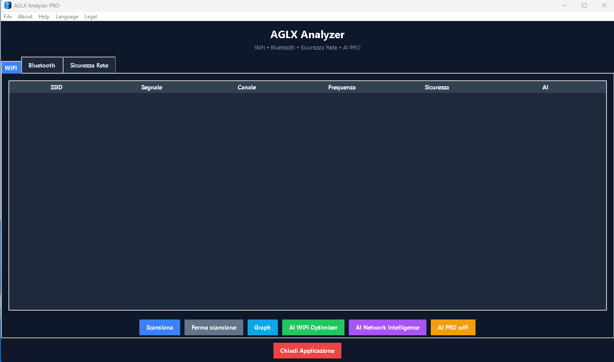

# AGLX WiFi Scanner PRO

  

<h2 align="center">Professional WiFi & Bluetooth Network Analyzer for Windows</h2>

  

  <a href="https://apps.microsoft.com/store/detail/9N6ZLKKC686X">
    <strong>🛒 Get AGLX WiFi Scanner PRO on Microsoft Store</strong>
  </a>

---

## About

**AGLX WiFi Scanner PRO** is a professional WiFi and Bluetooth network analyzer for Windows.

The application is designed to provide a clear and practical view of the wireless environment, helping users monitor networks, analyze signal conditions and inspect available channels.

## Features

* 📡 **WiFi Network Scanner**
* 📶 **Signal Strength Analysis**
* 📊 **WiFi Channel Analysis**
* 🔵 **Bluetooth Scanner**
* 📈 **Real-Time Network Information**
* 🤖 **Intelligent Channel Optimization**
* 🖥️ **Designed for Windows**
* 🔒 **Privacy-Focused Architecture**

## WiFi Analysis

AGLX WiFi Scanner PRO provides detailed information about detected wireless networks, including network identification, signal information, frequency, channel and security information.

The channel analysis helps users understand the wireless environment and identify possible channel congestion.

## Bluetooth Analysis

The application also includes Bluetooth scanning capabilities for monitoring nearby Bluetooth devices.

## Intelligent Channel Optimization

AGLX WiFi Scanner PRO includes an intelligent channel analysis system designed to evaluate the wireless environment and provide channel recommendations based on detected network conditions.

## Microsoft Store

AGLX WiFi Scanner PRO is available through the official Microsoft Store.

  <a href="https://apps.microsoft.com/store/detail/9N6ZLKKC686X">
    <strong>🛒 Download AGLX WiFi Scanner PRO</strong>
  </a>

## Privacy & Security

AGLX WiFi Scanner PRO is designed for network monitoring and analysis.

The application is intended for use on networks and devices that you own or are authorized to monitor.

Network analysis data is used for the application's monitoring and analysis functions. The application does not intentionally transmit sensitive personal information to external servers as part of these functions.

## System

* Windows
* WiFi adapter required for WiFi scanning
* Bluetooth adapter required for Bluetooth scanning

## Developer

**AGLX WiFi Scanner PRO**
Developed by **Gaetano Alabrese**

---

© 2026 AGLX WiFi Scanner PRO. All rights reserved.
